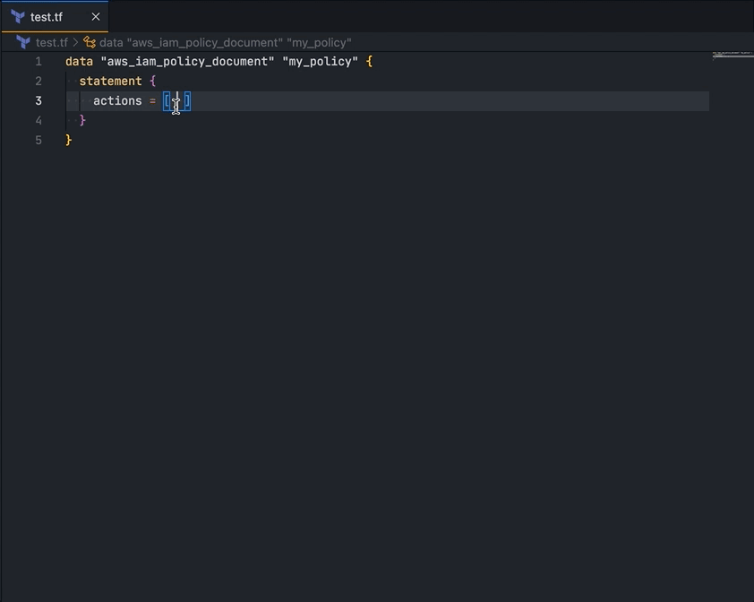

# aws-actions-helper

Aws action helper is an extension to help AWS action insertion in code or terraform file

## Features

- Insert one or multiple actions
- Multiple actions can be insert in JS array mode or plain text mode
- An side treeView is available.
  

## Known Issues

## To do list:

- Write tests

## Release Notes

Users appreciate release notes as you update your extension.

### 1.0.0

Initial release of aws-actions-helper

## Contribution

Feel free to contribute
